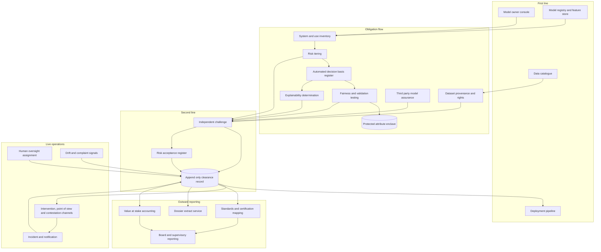

# Attestra

**Source:** `ai-in-ethics/Accenture-Realising-Economic-Societal-Potential-Responsible-AI-2/`
**Domain:** `ai-ethics`
**One-liner:** An AI assurance control plane for European enterprises that turns each automated-decision system's legal obligations into a standing, evidenced clearance to operate, so regulated use cases reach production on a schedule instead of stalling indefinitely in legal review.
**Wedge:** Solely-automated decisions in EU consumer-facing regulated sectors — retail banking credit and risk-based pricing, motor and health insurance underwriting, and utility and telecom collections — inside enterprises running 30–300 models, where GDPR Article 22 already bites and where a blocked use case has a quantifiable revenue or cost line attached.
**Positioning:** Second-line AI assurance, deliberately not first-line MLOps. Model-monitoring tools tell a model owner that drift occurred; Attestra tells a general counsel, a board risk committee and a supervisory authority whether a given system is lawfully deployable today, under which of the three lawful bases for automated decision-making, with which individual-rights safeguards actually live in the runtime, who is the named competent human overseer, and what gross value added the enterprise is forgoing while clearance is pending. The source's own conclusion — that a one-size-fits-all approach will not work and that governance should attach to the *use* of the technology rather than the technology itself — is the product's architecture, not its marketing.

## Market research synthesis

### Thesis from source

The paper's first move is to price the prize. Accenture's modelling with Frontier Economics across 12 developed economies concludes that AI could double annual economic growth rates and lift labour productivity by up to 40% by 2035, positioning AI as a new factor of production alongside capital and labour rather than as an efficiency programme. The member-state breakdown is unusually specific and is the reason an assurance product can be sold on upside rather than fear: Germany a US$1,079bn gross value added increase, the United Kingdom US$814bn, France US$589bn, the Netherlands US$311bn, Italy US$227bn, Sweden US$214bn, Spain US$189bn, Austria roughly US$140bn, Finland US$104bn, Belgium US$93bn. Each figure is decomposed into three channels — intelligent automation, augmentation and innovation diffusion — and the mix differs by economy in ways that predict which use cases a given enterprise will fight hardest to clear. Germany splits US$545bn automation, US$447bn augmentation and US$87bn diffusion; Sweden inverts it at US$83bn, US$108bn and US$23bn because of its high-skill labour force; France and the Netherlands are automation-weighted on the strength of chemicals, aviation, transport and refining.

The paper's second move is to show that Europe is not capturing that prize, and that the shortfall is a matter of investment, plan and ecosystem rather than talent. CB Insights figures cited in the report have Chinese AI start-ups taking 48% of total global investment in 2017, up from 11.3% in 2016, overtaking the United States at 38% and leaving the rest of the world 13%. Tencent Research Institute counted 2,617 AI companies globally as of June 2017, 1,078 in the US (41%) and 592 in China (23%), with roughly US$15.5bn of US capital investment (about 50% of the global total) against US$10bn in China (33%). The US government spent an estimated US$1.2bn on non-classified research in 2016 and DARPA sought US$3.44bn for fiscal 2019, an 8.5% increase. China's plan targets a US$150bn domestic AI industry, gave its top nine universities funding to establish AI schools and a further 32 to add AI programmes, with the Ministry of Industry and Information Technology planning nearly US$950m per year into strategic AI projects. Europe's own capability is concentrated: 50% of European AI companies sit in the UK, France and Germany, with 120-plus firms in the UK against 51 in Germany, 39 in France and 31 in Spain, and the EU Robotics Public Private Partnership allocated €700m of public research funding to 2020 within an overall €2.8bn including private money.

The third and commercially decisive move is the governance chapter, and it contains the insight this product is built on. The paper argues that the regulatory framework for automated decision-making in Europe already exists and is largely fit for purpose — it is the *implementability* that is missing. GDPR, supported by the Article 29 Working Party guidance, establishes a general prohibition on fully automated decision-making with exactly three exceptions: where it is necessary for a contract between an individual and an organisation, where it is authorised by EU or national law to which the organisation is subject, or where it rests on the individual's explicit consent. Under any of those exceptions the organisation must safeguard the individual's rights, freedoms and legitimate interests, at minimum providing the right to human intervention, the right to express a point of view, and the right to contest the decision, with materially greater restrictions where the data concerns health or racial or ethnic origin. The guidance expands the safeguards to include frequent assessments of processed data sets to check for bias, auditing algorithms to test that those used and developed by machine learning systems perform as intended, and standing mechanisms for the data subject to express a point of view and to obtain human intervention. Then comes the admission: "That is not to say that this is clear or practical for businesses or organisations in understanding how they can meet GDPR requirements," followed by the open questions — how can we audit algorithms, do requirements differ by AI application and by sector, what is the best way to set up assessments of processed data so bias is caught, how do we unpack black-box decision-making. An enterprise cannot answer those questions with a policy PDF; it answers them with a repeatable, evidenced control that produces the same artefact every time.

The paper's remaining chapters supply the rest of the product's surface area. On liability it points to Germany's 2017 self-driving vehicles law apportioning responsibility between driver and manufacturer according to who was in control, to Audi stating it would assume responsibility while its traffic jam pilot is in use, and to the European Commissioner for Transport's position that "no matter how technology works there is a human being that needs to be responsible for how it is used. Either using a joystick or pushing a button" — which makes named accountability, not abstract accountability, the recordable object. On data it notes that US fair-use defences permit commercial data mining while the proposed EU copyright exemption for text and data mining would reach only non-commercial research and cultural heritage institutions, potentially depriving start-ups and SMEs of the ability to build AI applications; that ownership of machine-generated IP is unclear enough to deter investment; that implementation of the public sector information re-use directive has been fragmented; and that sandboxing should be extended to data-sharing, with Data Trusts proposed under the UK AI Review. On codes and certification it surveys the IEEE-CS/ACM software engineering code of ethics, the Partnership on AI, the Asilomar principles, the IEEE Global Initiative for Ethical Considerations in AI and Autonomous Systems, and the ISO/IEC JTC 1/SC 42 technical committee, and argues that any approach recognised by regulators as meeting regulatory requirements should let companies implement those requirements practically and explain AI actions in a format people understand. Its own LaunchPad method, developed with the Alan Turing Institute, is a five-step sequence: understand public perception and potential impact, understand how humans would be impacted and the steps to mitigate negative impact, examine whether inherent bias exists in the data or the algorithm, determine where explainability of ai-driven decisions is necessary or desirable and how it can best be achieved, and develop a governance framework to monitor deployment. Finally, on workforce, it records at least 5,000 vacant ai-related positions in Germany in 2017, roughly 20% of jobs in most European countries involving a large number of automatable tasks falling well below 10% by 2035, 81% of executives expecting AI to work beside humans as a co-worker within two years, and only 3% of surveyed companies planning to significantly increase training and reskilling investment over three years — which is why the competence of the named human overseer is a control that must be evidenced rather than assumed.

### Buyer & economic model

- **Primary buyer:** the accountable executive who currently owns the delay — in most European enterprises a Chief Data or Chief AI Officer holding the deployment backlog jointly with the General Counsel or Data Protection Officer holding the veto. Sponsorship typically sits with the board risk committee, because the paper's growth argument is a board-level argument.
- **Users:** model owners and product managers seeking clearance (weekly), second-line model risk and validation reviewers exercising independent challenge (daily), the Data Protection Officer and privacy counsel registering lawful bases and impact assessments (per use case), fairness and validation analysts running assessments across protected attributes (per release), named human overseers handling intervention and contestation queues (daily), procurement and vendor risk teams performing third-party model due diligence (per vendor), internal audit and external certification assessors reading dossiers (periodic), and the board secretariat pulling portfolio reporting (quarterly).
- **Budget owner / value metric:** the enterprise risk and compliance budget funds the first purchase, but the renewal argument is owned by the business. The primary value metric is time-to-clearance for a regulated automated decision and the share of the AI portfolio holding a live clearance; the secondary metric is value at stake — the annualised contribution of use cases currently blocked or conditionally cleared, tagged by the source's three growth channels so the board sees whether it is forgoing automation, augmentation or diffusion value.
- **Competing status quo:** a spreadsheet model inventory maintained by second line, a Word-template AI impact assessment attached to each project, a legal opinion per use case that expires silently, an MLOps platform that monitors performance but knows nothing about lawful basis, and an annual internal audit that discovers the gap between the policy and the runtime. The nearest commercial substitutes are model risk management suites built for the banking capital-model tradition, which handle validation but not individual rights, and privacy management platforms, which handle records of processing but not model behaviour.

### Domain constraints

- **Regulatory / trust / safety:** the general prohibition on solely automated decision-making means the lawful basis is a per-decision-type property, not a per-model property, and it can be invalidated by a product change that neither legal nor the model owner notices. The three individual rights — human intervention, expression of a point of view, contestation — are operational commitments with response times, not policy statements. Special-category data attracts heavier restrictions, which produces the domain's sharpest paradox: demonstrating that a model does not discriminate on racial or ethnic origin generally requires attributes the enterprise is restricted from collecting, so the product must support lawful proxy and inference methodologies, separated-duty data enclaves, and an explicit record of which fairness claims are evidenced and which are merely asserted. Sectoral supervision compounds this: the same model behind a credit decision answers to a financial supervisor as well as a data protection authority, and the paper is explicit that requirements differ by application and sector.
- **Data sensitivity:** the assurance record itself is dual-sensitive. It contains legal analysis and admissions that are privileged or damaging if disclosed, and it contains individual-level contestation cases with personal data. Fairness testing needs sensitive attributes under strict purpose limitation and short retention. Dossiers shared with certification assessors, insurers and enterprise customers must be producible as scoped extracts rather than as raw access. Vendor due diligence records commonly sit under non-disclosure terms that forbid onward sharing of the vendor's own evaluation results.
- **Change-management realities:** second line cannot become the bottleneck it is meant to police, so clearance has to be tiered — low-risk systems self-attest against a standard control set, high-risk systems attract independent challenge. Model owners will not maintain a parallel inventory, so the inventory must be populated from the systems they already use. Legal will not accept an automated verdict, so the product issues evidence and a recommendation while the decision remains a named human's. And the skills constraint is real: with thousands of AI roles vacant and almost no enterprises materially increasing reskilling spend, the pool of people competent to exercise meaningful oversight is small, which makes oversight assignment and competency evidence a genuine scarce-resource allocation problem rather than a formality.

## Business requirements

- BR-1: Every AI system that contributes to a decision about a person must hold a current, named-owner clearance status that states whether it may operate, under what conditions, and until when, and no system may run in production against an expired or absent clearance without a recorded, time-boxed risk acceptance signed by a named executive.
- BR-2: For every solely-automated decision the enterprise makes about an individual, the platform must hold exactly one registered lawful basis drawn from contract necessity, EU or national law authorisation, or explicit consent, and must automatically flag the basis as invalidated when the decision's scope, population or degree of automation changes.
- BR-3: The three individual-rights safeguards — human intervention, expression of the data subject's point of view, and contestation of the decision — must be demonstrably live for each cleared automated decision, with a published response commitment, a monitored queue, and reporting on breaches of that commitment rather than an assertion that the rights exist.
- BR-4: Fairness assessment must be a scheduled, repeated obligation rather than a launch-time exercise, and each assessment must record which protected attributes were tested, whether they were observed or inferred, the lawful basis for holding them, and which fairness claims consequently remain unevidenced — a system may be cleared with an honest gap, but not with a silent one.
- BR-5: Explainability must be determined per use case rather than applied uniformly: the platform must record, for each cleared decision, whether an explanation is legally required, commercially desirable or unnecessary, who the explanation is for, and the form in which the recipient will actually receive it.
- BR-6: Independent challenge must be structurally separated from delivery — a clearance for a high-risk system is invalid unless reviewed by an assessor outside the owning business unit's reporting line, and the platform must make that separation evidenceable to internal audit.
- BR-7: Third-party and vendor-supplied models must clear the same obligations as internally built ones, and a vendor model may not be cleared on the vendor's own documentation alone: the record must show what the enterprise independently verified, what it accepted on assurance, and what contractual remedy applies if the vendor's claims fail.
- BR-8: Every cleared system must have a named human overseer with recorded competence to exercise that oversight and to overturn an automated outcome, and the platform must surface where the same individual is nominated across so many systems that the oversight is not credible.
- BR-9: The platform must report value at stake — the annualised financial contribution of use cases blocked, conditionally cleared or awaiting clearance — attributed to intelligent automation, augmentation or innovation diffusion, so that assurance is governed as an investment decision with a measured cost of delay rather than as an unpriced brake.
- BR-10: Conformity against recognised external codes, standards and certification schemes must be maintained as a live mapping from the enterprise's own controls to each scheme's requirements, so that a single control satisfies multiple schemes and a control failure immediately shows which external claims are affected.
- BR-11: Where an AI system contributes to physical safety or operates with a degree of autonomy, the platform must record the apportionment of responsibility between the enterprise, the supplier and the human operator for each operating mode, together with the insurance position, so that accountability is identified before an incident rather than negotiated after one.
- BR-12: Any dataset used to train or evaluate a cleared system must carry a provenance record covering source, licensing or text-and-data-mining rights, permitted commercial use, and — where derived from public sector or pooled sources — the sharing terms and the allocation of derived intellectual property, so that a downstream rights challenge cannot silently invalidate a production system.

## User stories

Canonical user stories live in sibling [USER_STORIES.md](USER_STORIES.md).

## System design

### Overview

Attestra maintains one authoritative record per AI system and, beneath it, one record per decision type that system contributes to — because the source's own conclusion is that governance attaches to use, not to technology. Around each decision type the platform assembles the obligations it triggers: the lawful basis for automation, the individual-rights safeguards and their response commitments, the fairness testing schedule and its evidenced scope, the explainability determination and the artefact the recipient receives, the impact assessment, the dataset provenance and rights position, the vendor assurance if the model is bought rather than built, the liability apportionment if autonomy or physical safety is involved, and the named human overseer with recorded competence. Evidence arrives from the enterprise's existing model registry, feature store, case management and procurement systems rather than being retyped. When the obligation set is satisfied, the platform issues a clearance with an expiry and conditions; when a control fails, a dataset's rights change, a decision's scope shifts or an overseer leaves, the clearance degrades automatically and the affected external conformity claims are flagged in the same movement. Portfolio state is then priced: every blocked or pending use case carries its annualised contribution tagged to intelligent automation, augmentation or innovation diffusion, so the board reads assurance as a throughput problem with a cost of delay.

### Actors & boundaries

- **Actors:** model owners and product managers, second-line model risk reviewers and validators, the Data Protection Officer and privacy counsel, fairness and validation analysts, named human overseers, procurement and vendor risk assessors, internal audit, external certification and conformity assessors, the board risk committee, supervisory authorities as recipients of reporting, and the affected individual who exercises intervention and contestation rights.
- **Trust boundary:** Attestra is a control-and-evidence plane, not an inference plane. It never holds production decision traffic and never re-runs a model on live data; it holds attestations, test results, artefacts and decisions about them. Special-category data used for fairness testing sits in a separately governed enclave with its own retention and access rules, and results leave the enclave as aggregates. Privileged legal analysis is compartmented from the general dossier so that an extract shared with a customer or assessor cannot leak counsel's advice. Vendor evaluation material carries its own onward-sharing constraints. The clearance record is append-only: a clearance can be superseded, never rewritten.
- **Human-in-the-loop points:** intended-use declaration and risk tiering by the owner; lawful-basis registration by privacy counsel; independent challenge and clearance decision by second line, outside the owning unit's reporting line; oversight acceptance by the named individual; intervention and contestation decisions on individual cases; risk acceptance by a named executive where a control gap is knowingly carried; and board approval of the portfolio's standing exception position.

### Core capabilities

1. **System and use inventory** — one record per AI system, one per decision type it feeds, with risk tiering, intended-use statements, populations affected, degree of automation and sectoral supervision in scope.
2. **Automated-decision basis register** — the lawful basis for each solely-automated decision, its supporting analysis, the change events that invalidate it, and the standing prohibition check for decisions with no valid basis.
3. **Safeguard operations** — configuration and live monitoring of human intervention, point-of-view and contestation channels, with published response commitments, queues and breach reporting.
4. **Fairness and validation testing** — scheduled assessments across protected attributes, recording observed versus inferred attributes, the lawful basis for holding them, methodology, results, and the fairness claims that remain unevidenced.
5. **Explainability determination** — per decision type, whether explanation is required, desirable or unnecessary, the intended recipient, the form delivered and the comprehension evidence where it exists.
6. **Independent challenge and clearance** — tiered review workflow with enforced reporting-line separation, blocking findings, conditions, expiry dates and superseding history.
7. **Third-party model assurance** — vendor due diligence, the split between independently verified and assurance-accepted claims, contractual remedies, and re-assessment triggers on vendor model updates.
8. **Human oversight assignment** — named overseers, recorded competence, capacity limits, acceptance or refusal, and concentration alerts where one person is nominated too widely.
9. **Dataset provenance and rights** — source, licence, text-and-data-mining position, permitted commercial use, public-sector or data-trust sharing terms, and derived-IP allocation.
10. **Liability and safety apportionment** — responsibility split between enterprise, supplier and human operator per operating mode, with the insurance position recorded alongside.
11. **Standards and certification conformity** — live mapping from internal controls to external scheme requirements, with impact propagation when a control fails.
12. **Incident and reporting** — AI incident capture, regulatory notification tracking, dossier extracts for assessors, and portfolio reporting for the board.
13. **Value-at-stake accounting** — annualised contribution of blocked, pending and conditionally cleared use cases, attributed to intelligent automation, augmentation or innovation diffusion.

### Conceptual data

- **Primary entities:** AiSystem, DecisionType, IntendedUseStatement, RiskTierAssessment, LawfulBasisRegistration, SafeguardConfiguration, ContestationCase, FairnessAssessment, ProtectedAttributeScope, ExplainabilityDetermination, AlgorithmAudit, ImpactAssessment, ClearanceRequest, ChallengeFinding, DeploymentClearance, RiskAcceptance, OversightAssignment, OverseerCompetency, ThirdPartyModel, VendorDueDiligence, DatasetProvenance, LiabilityApportionment, ConformityMapping, AiIncident, ValueAtStakeEstimate, ConformityDossier.
- **Critical events:** system registered, intended use declared, risk tier assigned, lawful basis registered or invalidated, safeguard channel activated, fairness assessment completed with scope caveats, explainability obligation determined, clearance requested, challenge finding raised and resolved, clearance issued, conditioned, degraded, expired or superseded, risk acceptance signed and expired, oversight nomination accepted or refused, contestation opened, escalated, decided or breached its commitment, vendor model updated, dataset rights changed, incident reported and notified, dossier extract issued.
- **Retention / audit needs:** clearance records, challenge findings and approvals retained append-only for the full supervisory and limitation period, reconstructable as at any past date. Fairness assessment results retained at aggregate level for trend analysis while the underlying special-category data is held under a short, purpose-limited clock inside the enclave. Contestation cases retained under the personal-data retention policy of the originating decision, with the outcome and timing retained in de-identified form for rights-performance reporting. Privileged legal analysis retained under separate access control and excluded from standard dossier extracts. Dossier extracts logged with recipient, scope and issue date so that a disclosure can be traced.

### Integrations (conceptual)

- **Systems of record:** the enterprise model registry and feature store for model lineage, the data catalogue for dataset identity and lineage, the GRC platform for the enterprise control library and audit findings, the privacy management platform for records of processing and impact assessments, procurement and contract lifecycle management for vendor terms and remedies, the HR system for reporting lines and overseer competence, and the finance planning system for use-case contribution figures.
- **Upstream signals:** deployment and release events from CI/CD indicating a scope or threshold change, drift and performance alerts from monitoring, customer complaint and ombudsman feeds, vendor model release notes and security advisories, licence and rights changes on external datasets, regulatory and standards publications affecting scheme requirements, and workforce capability data indicating oversight capacity.
- **Downstream actions:** clearance state published to the deployment pipeline so an uncleared or expired system cannot promote to production, contestation and intervention cases routed into the existing case management or contact centre queue, board and committee reporting packs, dossier extracts for certification bodies, insurers and enterprise customers, regulatory notifications, and procurement holds on vendor models that fail re-assessment.

### High-level architecture

Two flows meet in the clearance record. The obligation flow runs from use declaration through evidence collection and independent challenge to a clearance with conditions and an expiry. The operations flow runs continuously from live safeguard channels, monitoring and rights cases back into the clearance, degrading it when reality diverges from what was cleared. The deployment pipeline reads clearance state as a gate; the board reads the same state priced by growth channel.

### Success metrics

- **Leading:** median and 90th-percentile time from clearance request to decision by risk tier; share of the AI portfolio with a live, unexpired clearance; share of solely-automated decisions with a registered and currently valid lawful basis; proportion of fairness assessments completed on schedule and the share whose claims rest on observed rather than inferred attributes; contestation and intervention response times against published commitments; proportion of high-risk clearances reviewed outside the owning unit's reporting line; overseer concentration ratio; percentage of production datasets with a complete rights and provenance record; number of live risk acceptances and their median age.
- **Lagging:** use cases moved from blocked to cleared per quarter and the annualised contribution released, split by intelligent automation, augmentation and innovation diffusion against the source's channel model; regulatory findings, enforcement actions and complaint upheld rates on automated decisions; external certification and conformity assessments passed without major finding; incidents attributable to a control that had already been reported as failing; audit findings on the assurance function itself; and the cost of delay avoided, measured as the reduction in average pending-clearance days multiplied by the daily contribution of the affected portfolio.

## OpenAPI skeleton

Canonical HTTP surface lives in sibling [openapi.yaml](openapi.yaml). Summary:

- **Base path:** `/v1/...`
- **Auth:** `X-API-Key` for machine integration from the model registry, deployment pipeline, data catalogue and procurement systems; Bearer JWT for console users, whose role determines whether they may raise, challenge, clear, accept risk or only read.
- **Resource groups:** Inventory, Lawful Basis, Testing, Explainability, Clearance, Oversight, Contestation, Third-Party Models, Provenance, Conformity, Incidents, Value at Stake.
