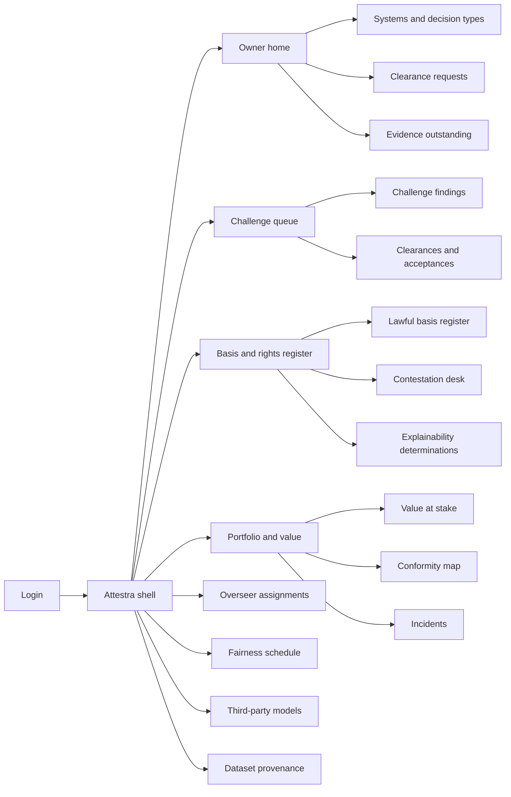
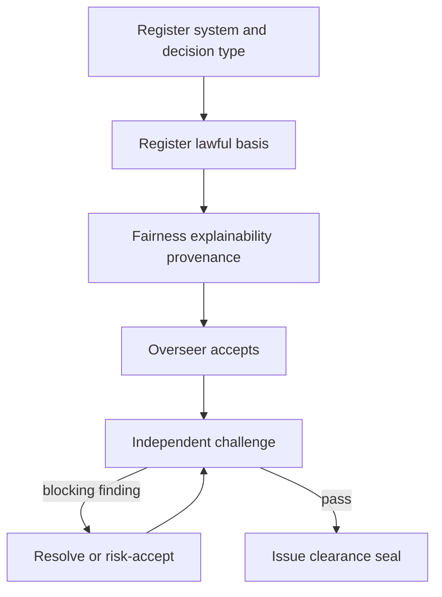

# Attestra — Web app

**Product:** [PRODUCT.md](./PRODUCT.md)
**Primary surface:** Second-line AI assurance console (clearance control plane for model owners, DPOs, challengers, overseers, and board risk)
**Secondary surfaces:** Contestation case desk (overseer-facing queue); scoped Conformity dossier extract viewer (read-only for assessors/insurers); deployment-gate status page (machine-readable clearance for CI/CD operators)
**Design thesis:** Attestra is a clearance desk for solely-automated decisions — closer to a port authority stamp and a rights-response operations floor than to an ML monitoring wall. The visual metaphor is a stamped clearance plate: cold Baltic blue ground, bone paper for dossier surfaces, and a single brass “cleared / conditioned / blocked” seal that never competes with vanity model scores. Every screen answers “may this decision type lawfully run today, under which Art. 22 basis, with which live safeguards, and what euro value is stuck while we wait?” — not “is the model accurate?”

## UX research synthesis

### Category peers (best-in-class)

- **Credo AI Governance:** Use-case → risk → policy → evidence packs with report export for boards and auditors. Steal: use-tied governance (not model-only cards) and evidence completeness as the primary progress cue; reject Credo’s broad “responsible AI platform” marketing chrome that dilutes Art. 22 specificity.
- **Holistic AI / Monitaur-style MRM portals:** Independent validation queues, model inventory, and challenge findings that block promotion. Steal: risk-tiered review queues and reporting-line separation cues; reject capital-model-only language that ignores individual rights and contestation SLAs.
- **OneTrust / TrustArc privacy ops:** Lawful-basis registers, RoPA-adjacent inventories, and assessor extract workflows. Steal: basis invalidation on scope change and purpose-limited enclaves for sensitive testing data; reject generic DPIA form wizards as the product’s hero surface.
- **ServiceNow / Case Management rights desks:** SLA clocks, breach-as-incident, dual-pane case context. Steal: published response commitments with live breach alerts for intervention/contestation; reject ITSM ticket aesthetics as the brand identity.

### Patterns to adopt / reject

- **Adopt:** Decision-type as the primary object (system → decision types beneath); clearance seal with expiry and conditions as chrome, not a buried field; value-at-stake priced by automation / augmentation / diffusion channels; independent-challenge gate with visible reporting-line conflict; honesty gaps on fairness (observed vs inferred attributes); overseer concentration heat; append-only clearance history reconstructable as-of date.
- **Reject:** First-line MLOps drift dashboards as home; purple “AI ethics score” gauges; one-size ethics checklist for every model; editable past clearances; fairness claims without attribute-scope disclosure; chatbot as clearance approver; cream-serif compliance brochure look.

### Trust, density, and workflow constraints from PRODUCT.md

Second line must not become the bottleneck it polices (tiered self-attestation vs independent challenge — BR-6). Legal will not accept an automated verdict: UI recommends and evidences; humans clear (BR-1). Special-category fairness testing needs enclave cues and short retention clocks (BR-4). Contestation/intervention are operational queues with published SLAs, not policy text (BR-3). Portfolio reporting must show cost of delay in euros by growth channel for the board (BR-9). Privilege and vendor NDA material must stay compartmented in dossier extracts (domain constraints).

## Information architecture

### Nav model

### Roles → default home

| Role | Default home | Why |
|------|--------------|-----|
| Model owner / product manager | Owner home — evidence outstanding + launch blockers | Weekly clearance path (stories) |
| Second-line reviewer / validator | Challenge queue by risk tier and expiry | Scarce challenge capacity (BR-6) |
| DPO / privacy counsel | Lawful basis and safeguards register | Supervisory answerability (BR-2, BR-3) |
| Named human overseer | Contestation desk | Daily intervention/contestation (BR-3, BR-8) |
| Fairness / validation analyst | Fairness schedule | Repeated obligation (BR-4) |
| Procurement / vendor risk | Third-party models | Independent verification split (BR-7) |
| Board risk / secretariat | Portfolio and value at stake | Investment-framed assurance (BR-9) |
| Internal audit / assessor | Clearance as-of + dossier extracts | Reconstructability |

### Cross-links to OpenAPI resources

| Nav area | OpenAPI tags / resources |
|----------|---------------------------|
| Systems and decision types | Inventory |
| Lawful basis register | Lawful Basis |
| Fairness schedule / enclave cues | Testing |
| Explainability determinations | Explainability |
| Challenge, clearances, risk acceptance | Clearance |
| Overseer assignments | Oversight |
| Contestation desk | Contestation |
| Vendor due diligence | Third-Party Models |
| Dataset rights | Provenance |
| Standards mapping / dossiers | Conformity |
| Incident and notification | Incidents |
| Board pricing | Value at Stake |

## Screen inventory

### Owner home

- **Purpose:** Answer “what still blocks my launch, who owes evidence, and what date can I commit?”
- **Entry:** Default post-login for first-line roles.
- **Layout regions:** Attestra wordmark + workspace; clearance seal summary for owned decision types; evidence-outstanding list (owner, due, obligation type); change-risk alerts (scope/threshold edits that would invalidate basis); value of owned blocked cases.
- **Primary actions:** Open clearance request; declare intended use; jump to outstanding evidence item.
- **Empty / loading / error:** Empty = register first system from model registry sync; loading = skeleton seals + list; error = retry with request id.
- **BR / story ties:** BR-1; model owner stories on evidence and design-time basis guidance.

### Systems and decision types inventory

- **Purpose:** Authoritative system record with decision types as the governance unit (use, not technology).
- **Entry:** Nav → Inventory; deep link from registry sync.
- **Layout regions:** System list (tier, clearance state, sector supervision); decision-type tree; intended-use statement; automation degree; population scope; risk tier assessment.
- **Primary actions:** Register system; add decision type; revise intended use (warns on clearance degrade); request clearance.
- **Empty / loading / error:** Empty = import from model registry; conflict 409 on material scope change surfaced as blocking banner.
- **BR / story ties:** BR-1, BR-2; change-management integration.

### Lawful basis register

- **Purpose:** Exactly one Art. 22 exception per solely-automated decision, with invalidation events visible.
- **Entry:** DPO home; decision-type detail.
- **Layout regions:** Register table (basis type, analysis summary, validity); invalidation timeline; prohibition flag when basis absent; design-time guidance panel for owners (contract / law / consent plausibility).
- **Primary actions:** Register basis; mark invalidated; export supervisory slice.
- **Empty / loading / error:** No basis on automated decision = coral prohibition state, not a soft warning.
- **BR / story ties:** BR-2; DPO stories.

### Fairness schedule and assessment

- **Purpose:** Recurring fairness obligation with honest scope: observed vs inferred attributes and unevidenced claims.
- **Entry:** Testing nav; clearance evidence checklist.
- **Layout regions:** Schedule calendar; assessment detail (attributes, observed/inferred, lawful basis for holding them, methodology, results); “claims remaining unevidenced” strip; enclave access cue and retention clock.
- **Primary actions:** Schedule assessment; complete with caveats; open enclave-gated run (results as aggregates only).
- **Empty / loading / error:** Overdue = amber operational incident; silent gap forbidden — clearance may proceed only with explicit caveat.
- **BR / story ties:** BR-4; second-line stories on inferred attributes.

### Explainability determination

- **Purpose:** Per decision type: required / desirable / unnecessary, recipient, and artefact actually delivered.
- **Entry:** Decision-type obligations; DPO nav.
- **Layout regions:** Determination form; sample artefact preview; comprehension evidence if present; link to contestation explanations.
- **Primary actions:** Set determination; attach artefact template; verify delivery path.
- **Empty / loading / error:** Undetermined on high-risk = blocks clearance submit.
- **BR / story ties:** BR-5.

### Challenge queue and findings

- **Purpose:** Independent challenge ordered by risk tier and expiry; findings that cannot be quietly closed by the owning unit.
- **Entry:** Second-line default home.
- **Layout regions:** Queue (tier, days to expiry, value at stake); case dossier panes; reporting-line conflict banner; finding list (blocking / conditional); recommendation vs human decision.
- **Primary actions:** Raise finding; resolve or accept formally; issue/condition/deny clearance; refuse review when reporting-line conflict.
- **Empty / loading / error:** Empty = healthy “no pending challenge”; blocked self-approval with hard stop.
- **BR / story ties:** BR-6; validator stories.

### Clearances and risk acceptances

- **Purpose:** Append-only clearance plate: operate / conditions / until when; risk acceptances age visibly.
- **Entry:** From challenge decision; audit as-of search.
- **Layout regions:** Live clearance seal; conditions list; expiry countdown; supersession history (never rewrite); risk acceptance register (named executive, expiry); as-of date picker for reconstruction.
- **Primary actions:** Supersede; sign risk acceptance; export historical clearance pack.
- **Empty / loading / error:** Expired/absent in production = pipeline gate failure banner with runbook.
- **BR / story ties:** BR-1; audit reconstructability story.

### Contestation and intervention desk

- **Purpose:** Live individual-rights operations with SLA clocks and overturn authority stated plainly.
- **Entry:** Overseer default; DPO alerts.
- **Layout regions:** Queue by commitment breach risk; case view (decision inputs, model reasoning summary, overturn authority); response commitment meter; breach incident link.
- **Primary actions:** Intervene; record point of view; decide contestation; escalate; decline oversight nomination from linked assignment.
- **Empty / loading / error:** Empty = rights channels healthy; breach = coral incident state with live region announce.
- **BR / story ties:** BR-3, BR-8; overseer stories.

### Overseer assignments

- **Purpose:** Named competent overseers with capacity limits and concentration alerts.
- **Entry:** Oversight nav; clearance checklist.
- **Layout regions:** Assignment matrix; competence evidence; acceptance/refusal; concentration heatmap (same person across many systems).
- **Primary actions:** Nominate; accept/refuse; rebalance overload.
- **Empty / loading / error:** Concentration over threshold blocks high-risk clearance submit.
- **BR / story ties:** BR-8.

### Third-party model assurance

- **Purpose:** Vendor models clear only with enterprise-verified vs assurance-accepted split and contractual remedies.
- **Entry:** Vendors nav; procurement deep link.
- **Layout regions:** Vendor model list; diligence checklist; verified vs accepted claims columns; remedy terms; re-assessment triggers on vendor updates.
- **Primary actions:** Record diligence; hold procurement; trigger re-assessment.
- **Empty / loading / error:** Vendor-doc-only clearance attempt = hard validation error.
- **BR / story ties:** BR-7.

### Dataset provenance

- **Purpose:** Training/eval datasets with licence, TDM rights, commercial use, and derived-IP allocation.
- **Entry:** Provenance nav; clearance evidence.
- **Layout regions:** Provenance cards as interaction containers; rights change timeline; clearance degrade link when rights shift.
- **Primary actions:** Attach provenance; flag rights change; open related clearances.
- **Empty / loading / error:** Incomplete provenance on production dataset = amber portfolio flag.
- **BR / story ties:** BR-12.

### Conformity map and dossier extracts

- **Purpose:** Live mapping of internal controls to external schemes; scoped extracts without privilege leak.
- **Entry:** Board/conformity nav; assessor invite link.
- **Layout regions:** Control ↔ scheme matrix; failure propagation (“which claims break”); extract builder (scope, recipient, exclusions for privileged/legal and vendor NDA); issue log.
- **Primary actions:** Generate extract; revoke access; open affected claims on control fail.
- **Empty / loading / error:** Extract denied scopes listed explicitly.
- **BR / story ties:** BR-10; domain sensitivity constraints.

### Portfolio and value at stake

- **Purpose:** Board composition: cleared / conditional / blocked / expired with annualised euro contribution by automation, augmentation, diffusion.
- **Entry:** Board risk default.
- **Layout regions:** Portfolio state composition (one job: priced delay); channel breakdown; top blocked use cases; live risk acceptances ageing; link to fund faster assurance decision.
- **Primary actions:** Export committee pack; drill to clearance; open risk acceptance list.
- **Empty / loading / error:** Missing finance contribution = “unpriced” state, not zero.
- **BR / story ties:** BR-9; board stories.

### Liability and safety apportionment

- **Purpose:** For autonomy/physical-safety systems, record enterprise / supplier / operator responsibility per mode plus insurance position.
- **Entry:** Decision-type obligations when safety flag set; incidents adjacency.
- **Layout regions:** Operating-mode table; apportionment; insurance position; pre-incident accountability statement.
- **Primary actions:** Record apportionment; attach insurance evidence.
- **Empty / loading / error:** Safety-flagged without apportionment blocks clearance.
- **BR / story ties:** BR-11.

### Incidents and notifications

- **Purpose:** Capture AI incidents and regulatory notification tracking tied back to clearance controls.
- **Entry:** Incidents nav; contestation breach escalation.
- **Layout regions:** Incident list; control-already-failing cue; notification timeline; dossier link.
- **Primary actions:** Open incident; mark notified; link degraded clearance.
- **Empty / loading / error:** Empty = no open incidents with last drill date.
- **BR / story ties:** Incident capability; lagging metrics.

## Key flows

1. **Clear a high-risk automated decision** — register system/decision type → declare use & tier → register lawful basis → schedule fairness + explainability → assign overseer → independent challenge → clearance with conditions/expiry; failure: reporting-line conflict or blocking finding.

2. **Scope change invalidates basis** — product changes population/automation → platform flags invalidation → clearance degrades → pipeline gate blocks promote → owner remediates or executive risk-accepts time-boxed.

3. **Contestation SLA breach** — case opens → commitment clock → breach → incident + ops alert → overseer decides with overturn authority → rights performance reporting.

4. **Board value-at-stake review** — portfolio by clearance state → channel attribution → choose fund assurance capacity vs accept delay → export pack.

5. **Vendor model re-assessment** — vendor release note → diligence gap → procurement hold → enterprise verification → clearance supersede or deny.

## Design system

### Tokens (CSS variables)

- `--color-ink: #E6EEF4` — primary text on deep ground
- `--color-baltic-950: #0A1620` — app ground
- `--color-baltic-900: #122433` — panels
- `--color-bone: #E8E2D6` — dossier / extract paper surfaces
- `--color-bone-ink: #1A2430` — text on bone
- `--color-brass: #C4A35A` — clearance seal accent (cleared)
- `--color-brass-dim: #7A6430` — seal on dark
- `--color-signal-clear: #2F6F5E` — live clearance
- `--color-signal-condition: #C4922A` — conditioned / caveat
- `--color-signal-block: #B5403A` — blocked / expired / prohibition
- `--color-steel: #7E93A8` — secondary labels
- `--color-enclave: #3A5F7A` — protected-attribute enclave cue
- `--font-display: "Source Serif 4", serif` — clearance titles and board figures only (not cream-terracotta brochure; paired with dark Baltic, not warm paper-as-app)
- `--font-body: "IBM Plex Sans", sans-serif` — console UI
- `--font-mono: "IBM Plex Mono", monospace` — clearance ids, as-of stamps, extract hashes
- `--space-1`…`--space-8`: 4px scale
- `--radius-sm: 3px`; `--radius-md: 6px` — stamp-like, not pill-heavy
- `--motion-seal: 200ms ease-out` — clearance state confirm
- `--motion-sla: 280ms ease-in-out` — commitment clock pulse near breach
- `--motion-degrade: 160ms linear` — clearance degrade flash
- Atmosphere: cool maritime night with faint harbour-grid; bone paper only on dossier/extract drawers; no stock “ethics handshake” photography.

### Typography & brand

- Display serif reserved for clearance seals, board value numerals, and login hero; body plex for dense registers.
- Brand wordmark “Attestra” left in shell chrome on every clearance-bearing view; never replaced by “Dashboard” as the strongest mark.
- Login shell: brand-first; one headline (“Clearance to operate”); one supporting line on Art. 22 deployability; one CTA — no KPI tile strip.

### Do / don’t

- **Do:** Lead with decision type and lawful basis; show observed vs inferred fairness honesty; enforce reporting-line separation in UI; price blocked backlog in euros by channel; treat clearance history as append-only.
- **Don’t:** ML accuracy hero charts; purple ethics glow; silent fairness gaps; editable settled clearances; card grids for static policy text; emoji compliance badges.

### Accessibility & domain trust cues

- AA+ contrast on brass/block/condition against Baltic and bone; state always text + icon, not colour alone.
- Live regions for SLA breach, clearance degrade, and pipeline gate failures.
- Focus order follows obligation → challenge → seal → operations.
- As-of reconstruction and extract issue logs are first-class trust affordances for auditors.

## Component patterns

- **ClearanceSeal** — operate / conditioned / blocked / expired with until-when and conditions.
- **LawfulBasisPlate** — single Art. 22 basis with invalidation timeline.
- **EvidenceOutstandingList** — owner, obligation, due, blocking weight.
- **FairnessHonestyStrip** — observed vs inferred vs unevidenced claims.
- **ReportingLineConflictBanner** — hard stop on self-approval.
- **ContestationSlaMeter** — commitment clock with breach state.
- **OverseerConcentrationHeat** — nomination overload cue.
- **ValueAtStakeChannelBreak** — automation / augmentation / diffusion euros.
- **DossierExtractBuilder** — scoped recipient export with privilege exclusions.
- **AsOfClearanceViewer** — historical reconstruction control.

## Out of scope for v1 web

- First-line model training/IDE; live inference replay on production traffic; consumer-facing rights portal white-label (enterprise case desk only); native mobile trader apps; replacement of enterprise GRC or privacy RoPA systems of record; public marketing microsite beyond login/attestation landing.
